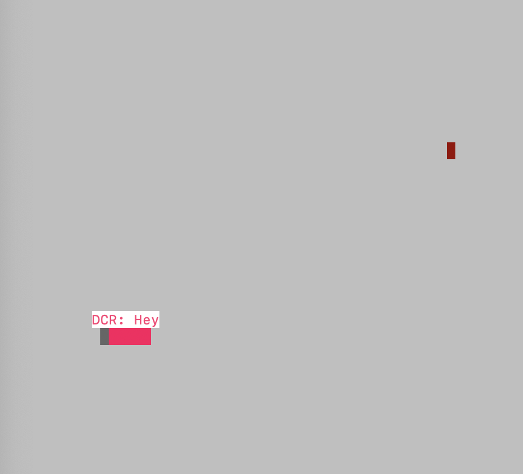
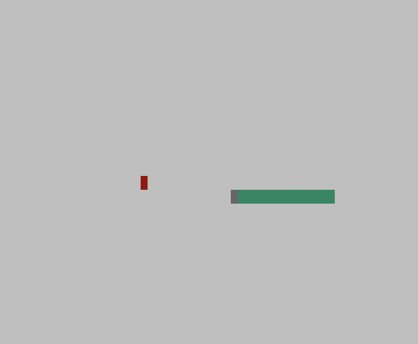

# Snake Client Project
Snake game is a multiplayer take on the popular video game concept where the player maneuvers a dot and grows it by 'eating' pieces of food. As it moves and eats, it grows, and the growing snake becomes an obstacle to smooth maneuvers. The goal is to grow the snake to become as big as possible without bumping into the side walls or itself, upon which it dies.

This client is designed to connect to the Snake Server, which you can download and install from [here](https://github.com/lighthouse-labs/snek-multiplayer)..

## Getting Started
To run this Snake Client, you need to follow these steps:

1. Follow the instructions in the Snake Server repository to run the server side.
2. Run the Snake Client using the node play.js command in your terminal.

## Final Product

## Contents
The Snake Client project consists of the following files:

* play.js: The main entry point of the Snake Client. It uses the connect() function from the client.js file to establish a connection to the Snake Server and sets up user input using the setupInput() function from the input.js file.
* client.js: Contains the connect() function, which handles the connection to the Snake Server using the net module in Node.js. It also sends and receives data to/from the server and sets the encoding to UTF-8.
* input.js: Contains the setupInput() function, which sets up user input from the terminal using the process.stdin stream in Node.js. It handles user input and sends corresponding commands to the server using the connection object.
* constants.js: Contains the IP address and port number constants used for connecting to the Snake Server.
